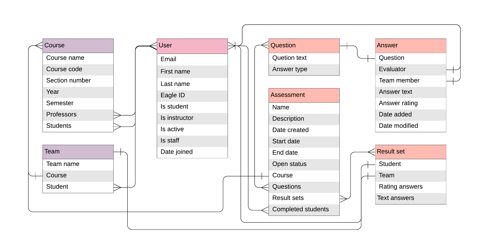
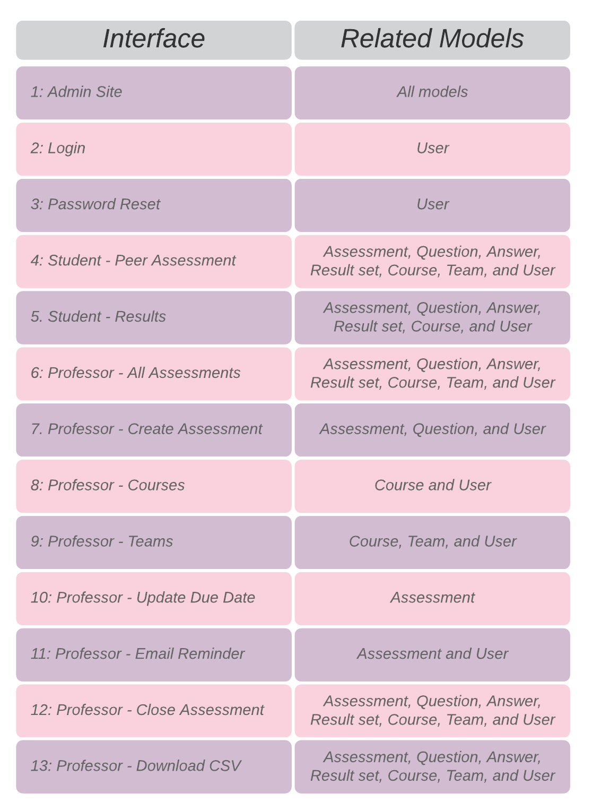

# Eagles Peer Evaluation System

## Installation
  - Install dependencies with pip  
    `$ pip install -r requirements.txt`
  - Run the server    
    `$ python manage.py runserver`  
  - Migration   
    `$ python manage.py makemigrations 'app name'`  
    `$ python manage.py migrate`  

 Suggested Browser: Google Chrome

## Apps in the project
**Project Folder:**
  - settings
  - urls

**Account App:**
  - Extended User Model
  - admin site

**Registration App:**
  - Course Model
  - Team Model

**Assessment App:**
  - Question Model
  - Answer Model
  - Result_set Model
  - Assessment Model

**Login App:**
  - home page
  - student login page
  - professor login page
  - password reset page
  - updater for sending emails

**Eval_student App:**
  - student dashboard page
  - peer assessments page
    - :arrow_right: answer assessment page
    - :arrow_right: edit answers
  - results page

**Eval_professor App:**
  - professor dashboard page
  - all assessments page :arrow_right: create new assessment page
  - my courses page :arrow_right: create new course page
  - teams & students page

## Data Models
  1. User Model (extends the built-in Django User Model)
  2. Course Model
  3. Team Model
  4. Question Model
  5. Answer Model
  6. Result_set Model
  7. Assessment Model
  
## Entity Relationship Diagram

## Data Model Traceability with Interfaces

